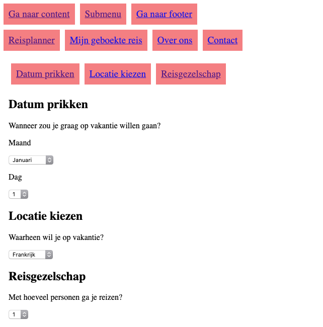

# Onderzoek webpagina voor visueel beperkten, en dan in het specifiek Larissa

Larissa kan enigzins onderscheid maken in kleuren/contrast, maar veel te weinig om van een scherm gebruik te maken. Niet blind vanaf geboorte dus braille is niet haar eerste schrijftaal.

## Prototype

Navigatie met meerdere lagen, hoofdmenu en submenu voor content.

Reisplanner waarbij naderhand een overzicht gegeven wordt, hierna kan de gebruiker nog bepaalde aspecten van de reis aanpassen.

## User scenario

Larissa wil een reis boeken, maar de conventionele methodes om dat te doen voldoen niet. Om wel op een plezierige manier een reis te boeken besluit ze mijn applicatie te gebruiken.

## Testen:

- Navigatie layout met meerdere lagen
- Content aanpassen met javascript
- Content aanpassen met CSS
- Content continu aanpassen
- Focus veranderen met js
- Aria-live="polite" zorgt voor opnieuw lezen
- Wanneer brailleregel gebruiken?
- Maakt de brailleregel geluid?

## Uitslag/bevindingen test 1 met Larissa

- Voornamelijk gebruik brailleregel:
  - spelling checken
- Geluid is er wel maar erg zacht
- Navigeren is lastig op:
  - Ticketboek sites
  - Buienradar (de graphic)
  - iFrames
  - Dropdowns
  - JavaScript generated content
- Goede voorbeelden:
  - Site van de NS
  - Stichting accesibility
- Skip to content is handig
- Meerdere manieren om iets af te sluiten
- Ctrl + home om opnieuw te beginnen wanneer de draad kwijt is
- Screenreaders:
  - NVDA opensource om te testen
  - Larissa gebruikt meestal JAWS, en apple voice over op mobiel/iPad
- Goed omschrijvende H1's, en maar één per pagina
- Navigatie goed bruikbaar, maar volgorde van tab-index kan verbeterd worden

## Braille leesregel / Braille display/terminal online research

- 1 regel
- 40 - 80 tekens
- braille toetsenbord/hotkeys
- tekst van screenreader op de regel
- compatible met meeste screenreader software maar meest genoemde is JAWS voor windows
- Navigatie functie
- Typfunctie

## Eigen tests met de brailleregel

Wanneer past content aan naar de brailleregel?
Aria live polite werkt, brailleregel komt altijd overeen met de text to speech.

dit deel van de read me is geschreven op de braille regel

dat gebeurt door middel van een perkins stijl toetsenbord met acht toetsen

## Bevindingen gebruik brailleregel

Ondertussen achterhaald door de meeste text to speech, voornamelijk vanwege de snelheid van het gebruik. Omdat Larissa niet vanaf haar geboorte blind is kan zij minder snel braille lezen dan TTS software gebruiken. Daarom kwam ik uit op de volgende twee ideeeën:

## Ideeën met de brailleregel

- Spelling checker
- Testen werking brailleregel punten

Omdat dit 2 handigheidjes zijn, maar geen applicaties die het gebruik van de rest van het internet gemakkelijker kunnen maken heb ik besloten door te gaan met een prototype dat ook werkt zonder de brailleregel.

## Testen 2

- Verder gegaan op ticketboek sites moeilijkheden, datumprikker met aanpasmogelijkheid toegevoegd aan de bestaande navigatie die ik had gemaakt
- Volgorde van navigatie verbeterd dmv tab-index
- Aria labels om content in dropdowns aan te geven

## Uitslag/bevindingen test 2 met Larissa

- Verdieping gebruik brailleregel:
  - Tekst controleren (spelling)
  - Weinig voor navigatie, maar dit is wel mogelijk
  - Emoji's worden wel uitgesproken door de screenreader maar komen niet op de regel
  - Braille is voor Larissa (maar niet voor iedereen met een visuele beperking) langzamer dan text to speech
  - Werkt altijd icm screenreader wanneer hij gebruikt wordt op de computer, ook zelfstandig te gebruiken voor bv notitities
- Als je alternatieve controls gebruikt is het belangrijk deze aan te duiden, anders zal iemand altijd de 'normale' manier van navigeren proberen
- Labels op invoervelden zijn belangrijk
- Om de screenreader een verhaal door te laten vertellen moet alles in één `

` staan, als er het verschillende zijn wordt het verhaal onderbroken
- **Screenreader kan bijna nooit zijn verhaal afmaken door de snelheid van het navigeren**
- Erg enthousiast over spelelementen in de applicatie
- Toetsen van brailleregel blijven af en toe hangen wat zorgt voor verwarring
- Datumselectie werkt goed (standaard html select elementen zijn voldoende)
- Lastig om naderhand selectie nogmaals te horen, wellicht een 'summary' aan het einde

## Aanpassingen prototype

- Gebruiker aan het einde een overzicht geven van de selecties die zijn gedaan
- aria labels gebruiken voor de screenreader
- tab-index=0 wanneer content met tab bereikbaar moet zijn
